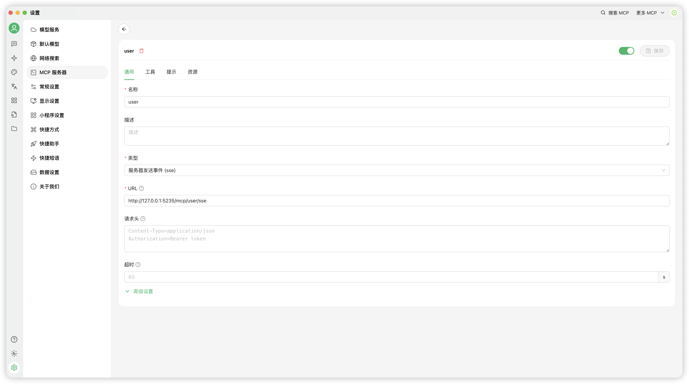
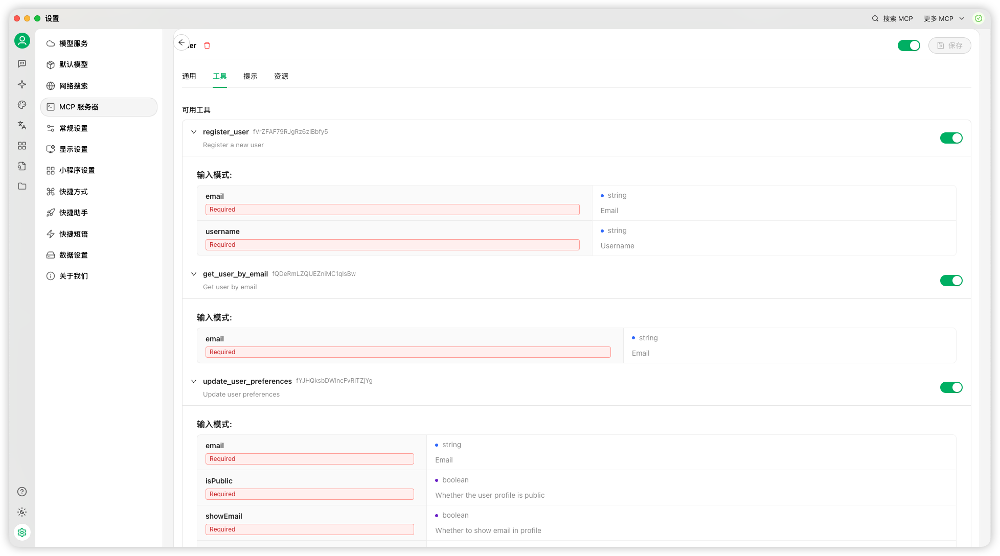
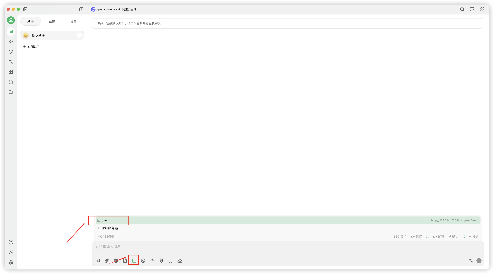
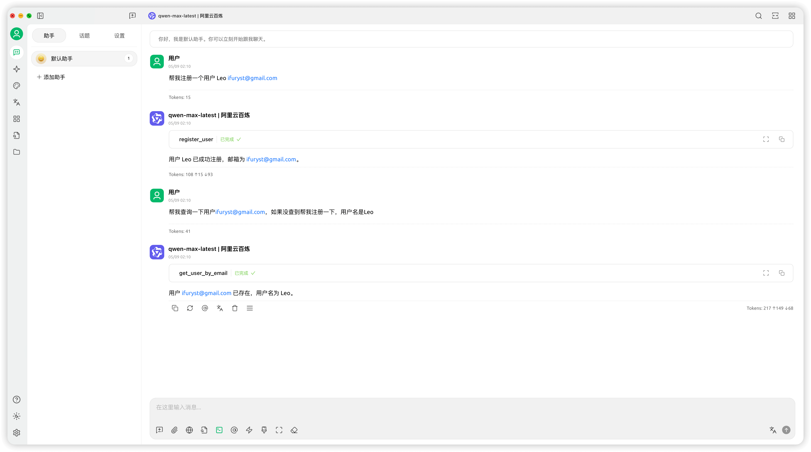

# Cherry Studio MCP कॉन्फ़िगरेशन गाइड
Cherry Studio एक डेस्कटॉप क्लाइंट है जो कई बड़े भाषा मॉडल (LLM) सेवा प्रदाताओं का समर्थन करता है, Windows, Mac और Linux सिस्टम के साथ संगत है।
Cherry Studio Github: [cherry-studio/docs/README.zh.md](https://github.com/CherryHQ/cherry-studio/blob/main/docs/README.zh.md)

> **Cherry Studio MCP कॉन्फ़िगरेशन के अधिक विस्तृत ट्यूटोरियल के लिए, कृपया आधिकारिक दस्तावेज़ देखें:**  
> https://docs.cherry-ai.com/advanced-basic/mcp

सबसे पहले, हम **MCP सर्वर** सेटिंग्स में MCP सर्वर कॉन्फ़िगर करते हैं। यहां हम परीक्षण के लिए अपनी स्वयं की सिमुलेटेड उपयोगकर्ता सेवा का उपयोग करते हैं:


अगला, दाईं ओर के बटन पर क्लिक करके इसे सक्रिय करने के बाद, **टूल्स** पर क्लिक करें ताकि इस MCP सेवा में टूल्स, उनके पैरामीटर्स और पैरामीटर प्रकार देख सकें।



अंत में, आप इसे चैट विंडो में आज़मा सकते हैं। उदाहरण के लिए, इसे एक उपयोगकर्ता को पंजीकृत करने और फिर उस उपयोगकर्ता की जानकारी को क्वेरी करने के लिए कहें। यदि यह काम करता है, तो आप सेट हैं।

उदाहरण के लिए, आप टाइप कर सकते हैं:
```
मुझे एक उपयोगकर्ता Leo ifuryst@gmail.com पंजीकृत करने में मदद करें
```

```
मुझे उपयोगकर्ता ifuryst@gmail.com को क्वेरी करने में मदद करें, यदि नहीं मिला तो कृपया उपयोगकर्ता नाम Leo के साथ पंजीकृत करें
```




> **LLM के साथ चैट करते समय, आप देख सकते हैं कि इंटरैक्शन प्रक्रिया के दौरान, यह कार्य इरादों को बुद्धिमानी से पहचानता है और स्वचालित कॉल के लिए टूलसेट से इष्टतम टूल्स का स्वचालित रूप से चयन करता है**

👇👇👇👇👇👇 यदि आप इसे पूरा करने में मदद करना चाहते हैं तो यहां क्लिक करें, आपका बहुत धन्यवाद ❤️ 